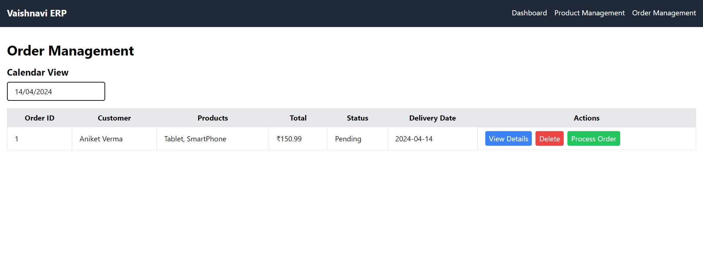

# ERP Dashboard

This is a web application for managing various aspects of an enterprise resource planning (ERP) system. It includes modules for managing orders, products, sales, customers, inventory, and financials.

## Table of Contents
- [Features](#features)
- [Technologies Used](#technologies-used)
- [Installation](#installation)
- [Usage](#usage)
- [Screenshots](#screenshots)

## Features
- **Orders Management:** View, add, edit, and delete orders. Track order statuses.
- **Products Management:** Manage products, including their names, categories, prices, and quantities.
- **Sales Tracking:** Monitor sales data and trends over time.
- **Calendar View:** Filter Order Details via selecting Calendar
## Adding More Cards to UI
- **Customers Management:** Maintain a database of customers.
- **Inventory Management:** Keep track of available inventory for each product.
- **Financials Overview:** View total revenue generated by the system.

## Technologies Used
- **Frontend:**
  - React.js: JavaScript library for building user interfaces.
  - React Router: Library for routing in React applications.
  - Tailwind CSS: Utility-first CSS framework for styling.
  - React Icons: Library for including icons in React applications.
  - React DatePicker: Datepicker component for React.

## Installation
1. Clone the repository: `git clone <repository-url>`
2. Navigate to the project directory: `cd erp-store`
3. Install dependencies: `npm install`

## Usage
1. Start the development server: `npm start`
2. Open your browser and go to [http://localhost:3000](http://localhost:3000)

## Screenshots
1. 
2. 
3. 
4. 

